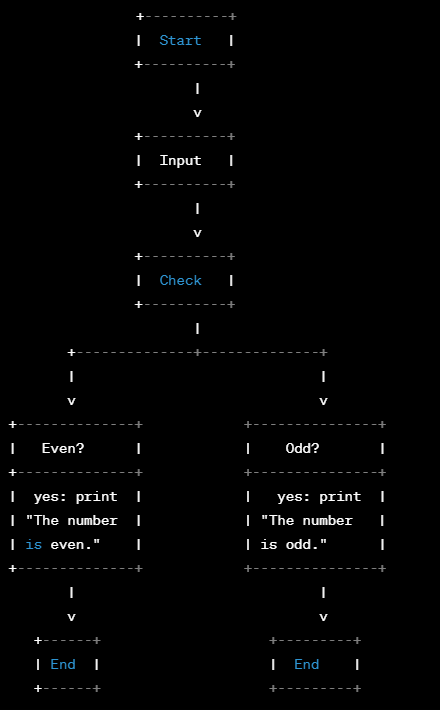

# CHALLENGES FROM WEEK # 1 - Wednesday & Thursday

## Index
- [Let's Make Pizza](#1-lets-make-pizza)
- [Hot'N Cold](#2-hotn-cold)
- [Geometry](#3-geometry)
- [Numbers](#numbers)
- [Date of Birth](#date-of-birth)

#
## 1. Let's Make Pizza
 1. find the ingredients
    - 1 cup of flour
    - 1 teaspoon fine sea salt 
    - 3/4 teaspoon active dry yeast
    - 1 teaspoon extra-virgin olive oil
    - 1 cup tomato sauce
    - 1/2 pound pepperoni 
    - 3/4 pound Mozzarella cheese

2. Preparation of the dough
    - Mix the flour, salt, active dry yeast, and extra-virgin olive oil
    - with your hands knead the dough until all ingredients are integrated
    - prepares dumplings from the fist of hand
    - let the dumplings rest in the refrigerator for 30 minutes covered with a blanket

3. Prepare the pizza
   - take the dumpling off the refrigerator
   - stretch the dough and create a circular shape
   - add tomato sauce over the dough
   - add the mozzarella cheese
   - add the pepperoni

4. Bake the pizza
    - preheating the oven to 450 Fahrenheit degrees for 10 minutes
    - when the oven has the temperature expected take the dough and put inside the oven. 
    - bake for 20 minutes
    - take off the pizza
5. serve the pizza
    - cut the pizza into triangle pieces
    - put on a plate with your favorite beverage
    - you can add some olive oil to extra flavor during your meal.
#
## 2. Hot'N Cold
- Fahrenheit to Celsius Algorithm:
    - Subtract 32 from the Fahrenheit temperature.

    - Multiply the result by 5/9 to get the temperature in Celsius.
    The formula can be expressed as:
    C = (F - 32) * 5/9 Where C is the temperature in Celsius and F is the temperature in Fahrenheit.

- Celsius to Fahrenheit Algorithm:
    - Multiply the Celsius temperature by 9/5.

    - Add 32 to the result to get the temperature in Fahrenheit. The formula can be expressed as:
    
        F = (C * 9/5) + 32

        Where F is the temperature in Fahrenheit and C is the temperature in Celsius.

#

## 3. Geometry
- Select the figure to calculate the Volume
    - If Select Volume of a Pyramid the Algorithm is:

        - Enter the weight of the base of pyramid as 'weight'
        - Enter the width of the pyramid as 'width'
        - Enter the Height of the pyramid 'h'
        - Multiply the weight by the width of the pyramid to determine the base area 'B'
        -  Multiply the base area by the height of the pyramid.
        - Divide the result by 3 to get the volume 'VPyramid'.
        The formula can be expressed as:

            V = (B * h) / 3

                
        - Print Volume as 'Volume Pyramid'

    - If select volume of a Cube the Algorithm is :
        - Measure the length of one side of the cube as 's'
        - Cube the length to get the volume as 'Vcube'
            The formula can be expressed as:

            V = s^3

        - Print 'Vcube'

    - If select volume of a Sphere the Algorithm is:

        - Measure the radius of the sphere as 'r'
        - Cube the radius and multiply it by π as 'pi' 
        - Multiply the result by 4/3 to get the volume as 'Vsphere'.
            The formula can be expressed as:

            V = (4/3) * π * r^3

        - Print Volume 'Vsphere'

# 

## Numbers

- Check if the number is even or odd:
- Divide the number by 2.
- If the remainder is 0, the number is even.
- If the remainder is not 0, the number is odd.
- Print the result:
    - If the number is even, print "The number is even."
    - If the number is odd, print "The number is odd."
- Flowchart

    

#

## Date of birth

The pseudocode for the date of birth calculation is

1. Ask the user for their date of birth
2. Get the current date
3. Calculate the difference between the current date and the user's date of birth
4. Convert the difference into years
5. Print the age in years to the console
