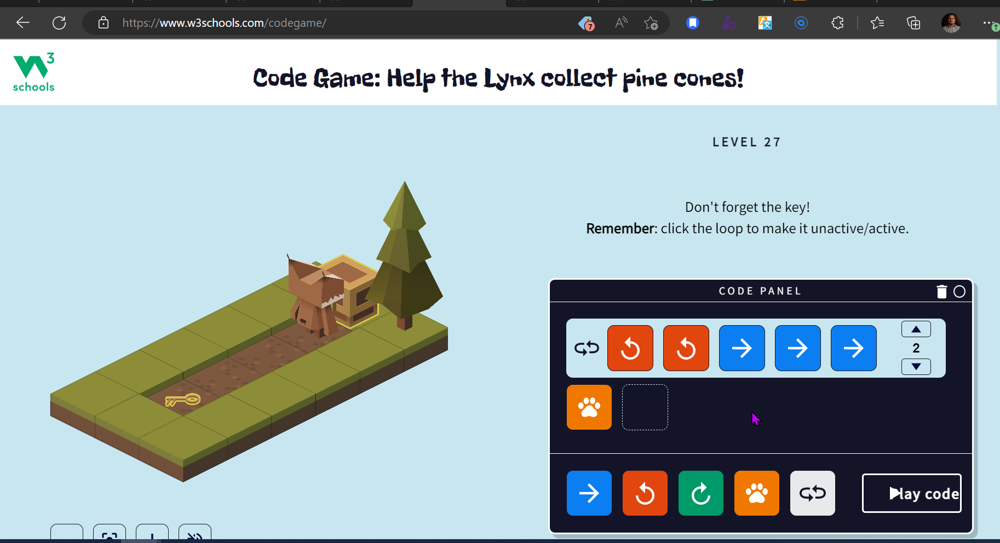

# CHALLENGES FROM WEEK # 2 

## Index
- ### Week challenges (Monday)
    - [1. Logic Problem](#1-logic-problem)
    - [2. Cereal Vs Milk](#2-cereal-vs-milk)
- ### Week challenges (Tuesday)
    - [1. Print My Name](#1-print-my-name)
    - [2. Print My Name & age](#2-print-my-name--age)
- ### Week challenges (Wednesday)
    - [1. Algorithm game](#1-algorithm-game)
    - [2. Mod](#2-mod)
    - [3. Register form](#3-register-form)
- ### Week challenges (Thursday)
    - [1. Truth Tables](#1-truth-tables)
    - [2. Boolean results](#2-boolean-results)
    - [3. Identify odd and even numbers](#3-identify-odd-and-even-numbers)

#

## Week challenges (Monday)

## 1. Logic Problem

From the given statements, we can see that the number of people who studied mathematics yesterday must be either 1, 2, 3, or 4. We need to find out which of the statements are true based on this information.

If Alice's statement were true, then nobody studied math yesterday, which would mean that all of the other statements must be false. However, this would mean that nobody is telling the truth, which is impossible. Therefore, Alice's statement must be false.

If Eva's statement were true, then 4 people studied math yesterday, which would mean that Dan's, Charlie's, Bob's, and Alice's statements must all be false. However, this would mean that only Eva is telling the truth, which is also impossible. Therefore, Eva's statement must be false.

If Dan's statement were true, then 3 people studied math yesterday, which would mean that Charlie's, Bob's, and Alice's statements must all be false. This leaves only Dan and Eva as possible truth-tellers. However, since we know that only one person studied math yesterday, Dan's statement cannot be true.

If Charlie's statement were true, then 2 people studied math yesterday, which would mean that Bob's and Alice's statements must both be false. This leaves Charlie, Dan, and Eva as possible truth-tellers. However, since we know that only one person studied math yesterday, Charlie's statement cannot be true.

This leaves only Bob's statement, which says that 1 person studied math yesterday. This is consistent with our previous analysis, which showed that none of the other statements could be true. Therefore, Bob is the only one telling the truth.

#

## 2. Cereal Vs Milk


### Pseudocode
- Get a bowl
- Pour desired amount of cereal into the bowl
- Get a carton of milk
- Open the milk carton
- Pick up a milk jug
- Pour desired amount of milk into the jug
- Pour milk from the jug into the bowl of cereal
- Enjoy!

### Flowchart

.jpg)

#

## Week challenges (Tuesday)

## 1. Print My Name

 - this the print in Pseint


- The code
    - [Print my Name Code](MyName.psc)

## 2. Print my name & Age

- this the print in Pseint


#

## Week challenges (Wednesday)

## 1. Algorithm game




## 2. Mod


## 3. Register form


#

## Week challenges (Thursday)
## 1. Truth Tables

1. T `&` T = T ✅
2. T `&` F = F ✅
3. F `&` T = T ❌
4. F `&` F = F ✅
5. T `|` T = T ✅
6. T `|` F = F ❌
7. F `|` T = T ✅
8. F `|` F = F ✅
9. `~`T = T ❌
10. `~`F = T ✅
11. (T `&` F) `|` (`~`F) = T ✅
12. (T `|` F ) `&` (F `|` F) = T ❌
13. `~`((T `|` F ) `&` (F `|` F)) `&` F = F ✅
14. `~`((T `|` F ) `&` (F `|` F)) `&` T = T ✅

## 2. Boolean results
``` java
Algoritmo boolean
// Inicialización de variables

a <- 5 == 3 
// a = false
// explanation: it compares if 5 is equal to 3, since this is not true, the variable a is set to the value false.

b <- 4 <> 3 
// b = true
// explanation: it compares if 4 is different from 3, since this is true, the variable b is set to the value true.

c <- 7 > 7 
// c = false
// Explanation: it compares if 7 is greater than 7, since this is not true, the variable c is set to the value false.

d <- 4 < 4 
// d = false
// explanation: it compares if 4 is less than 4, since this is not true, the variable d is set to the value false.

e <- 100 <= 90 
// e = false
// explanation: it compares if 100 is less than or equal to 90, since this is not true, the variable e is set to the value false.

f <- 40 >= 40 
// f = true
// explanation: it compares if 40 is greater than or equal to 40, since this is true, the variable f is set to the value true.
FinAlgoritmo
```

## 3. Identify odd and even numbers

 - Even

- Odd
